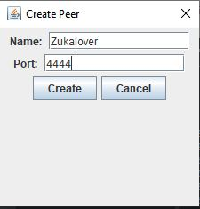

#"Peer To Peer(P2P) Chat Java network programming Swing application" 

##This Application is inspired by the peer to peer programming used to build block chain and other peer applications

Research paper reference - http://cs.berry.edu/~nhamid/p2p/  -> And other bunch of papers will be referenced here

##ScreenShoots to the application

